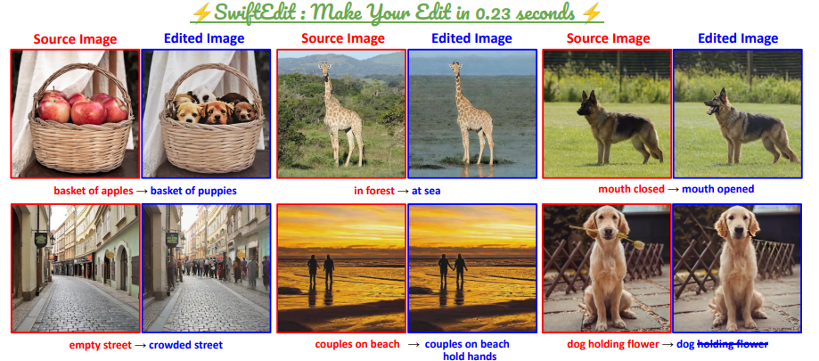
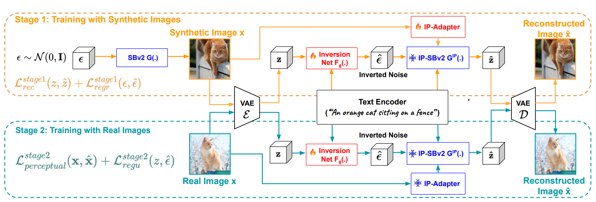

# [CVPR25]⚡SwiftEdit: Lightning Fast Text-guided Image Editing via One-step Diffusion
<div align="center">
  <a href="https://swift-edit.github.io/"></a> &ensp;
  <a href="https://openaccess.thecvf.com/content/CVPR2025/papers/Nguyen_SwiftEdit_Lightning_Fast_Text-Guided_Image_Editing_via_One-Step_Diffusion_CVPR_2025_paper.pdf"></a> &ensp;
  <a href="https://huggingface.co/papers/2412.04301"></a> &ensp;
</div>

**Official PyTorch implementation** of our CVPR 2025 paper:
["**SwiftEdit: Lightning Fast Text-guided Image Editing via One-step Diffusion**"](https://openaccess.thecvf.com/content/CVPR2025/papers/Nguyen_SwiftEdit_Lightning_Fast_Text-Guided_Image_Editing_via_One-Step_Diffusion_CVPR_2025_paper.pdf)

Author List:
[Trong-Tung Nguyen](https://scholar.google.com/citations?user=r9GRTJ4AAAAJ&hl=en),
[Quang Nguyen](),
[Khoi Nguyen](https://www.khoinguyen.org/),
[Anh Tran](https://scholar.google.com/citations?user=FYZ5ODQAAAAJ&hl=en),
[Cuong Pham](https://scholar.google.com/citations?user=C0I_9QYAAAAJ&hl=en)

> **Abstract**: 
Recent advances in text-guided image editing enable users to perform image edits through simple text inputs, leveraging the extensive priors of multi-step diffusion-based text-to-image models. However, these methods often fall short of the speed demands required for real-world and on-device applications due to the costly multi-step inversion and sampling process involved. In response to this, we introduce SwiftEdit, a simple yet highly efficient editing tool that achieve instant text-guided image editing (in 0.23s). The advancement of SwiftEdit lies in its two novel contributions: a one-step inversion framework that enables one-step image reconstruction via inversion and a mask-guided editing technique with our proposed attention rescaling mechanism to perform localized image editing. Extensive experiments are provided to demonstrate the effectiveness and efficiency of SwiftEdit. In particular, SwiftEdit enables instant text-guided image editing, which is extremely faster than previous multi-step methods (at least 50× times faster) while maintain a competitive performance in editing results.



## 📑 Citation
If you find this repository helpful for your work, consider dropping a star-it really means a lot and keeps the motivation going! Also please cite the author's paper to acknowledge their contribution:

```
@InProceedings{Nguyen_2025_CVPR,
    author    = {Nguyen, Trong-Tung and Nguyen, Quang and Nguyen, Khoi and Tran, Anh and Pham, Cuong},
    title     = {SwiftEdit: Lightning Fast Text-Guided Image Editing via One-Step Diffusion},
    booktitle = {Proceedings of the Computer Vision and Pattern Recognition Conference (CVPR)},
    month     = {June},
    year      = {2025},
    pages     = {21492-21501}
}
```

## 💡 Introduction
We introduce SwiftEdit, a user-friendly and lightning-fast text-guided image editing tool that enables instant edits through simple and flexible prompts. Our core designs include:

(1) **One-step Inversion Framework**: Unlike traditional diffusion-based multi-step inversion techniques, we trained a novel inversion network that can instantly invert any given source input images into noisy latents. \
(2) **One-step Text-to-image Generation Model**: We leverage recent advances in one-step text-to-image generation, for example [SwiftBrushv2](https://swiftbrushv2.github.io/), which produces high quality with diversity at lightning speed. \
(3) **Two-stage training strategy**: We trained our inversion framework via two-stage strategy with simple reconstruction objective using synthetic data generated by image generation model in stage 1, and real image data in stage 2.\
(4) **Attention Rescaling for Mask-awared Editing**: Our well-trained inversion network can automatically produce **self-guided editing mask**, which is leveraged to guide the editing process via attention rescaling techniques.




## 🔧 Dependencies and Installation
All the implementations were carried out on Ubuntu 22.04 using a single A100 40GB, but the setup should be compatible with other GPU models that have at least 24GB of VRAM.

First, clone the repository

```
git clone https://github.com/Qualcomm-AI-research/SwiftEdit.git
```

Install required packages as listed in the requirements file and other packages as follows.

```
conda create --name SwiftEdit python==3.12
pip install -r requirements.txt

# Independent installation to avoid conflicts
pip install numpy==1.26.4
```

## 📍 Checkpoints
We have published SwiftEdit's pretrained weights via releases of this repository. Please download all required checkpoints and specify corresponding weight's path before editing.

## 📁 Repository Structure
The main inference code is at ```infer.py```. Below is a small description of each of the scripts / main directories:

```text
SwiftEdit
├───assets/imgs_demo: Images for testing.
├───src: 
│   ├───attention_processor.py: Base IP-Adapter code.
|   ├───mask_attention_processor.py: Our customized IP-Adapter code for mask-guided attention.
|   ├───mask_ip_controller.py: Attention rescaling with mask-guided.
├───infer.py: Main logic code for editing.
├───models.py: Image generation and inversion model.
├───requirements.txt: Required packages to run this repository.
└───README.md: This README file.
```

## 🏃 Applications
For more editing examples, visit our [project page](https://swift-edit.github.io/) or watch our [video demonstration](https://youtu.be/my0AdUPTi9A?si=dqkZM04Q-X7gtPll) to learn more!


## 🖌️ Try your edits
Locate path to our provided checkpoints, source input images (or try our prepared examples in ```assets/imgs_demo```), source prompt (optional), and edit prompt in ```infer.py``` to test your own edits.

## License

SwiftEdit is licensed under the [BSD-3-clause License](https://spdx.org/licenses/BSD-3-Clause.html). See [LICENSE](LICENSE) for the full license text.

## Contacts

If you have any questions or suggestions about this repository, feel free to contact the first-author at
(tunnguy@qti.qualcomm.com) or (nguyentrongtung11101999@gmail.com)
